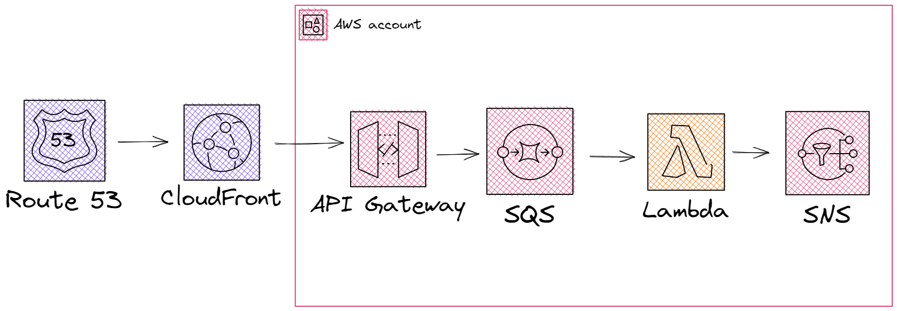
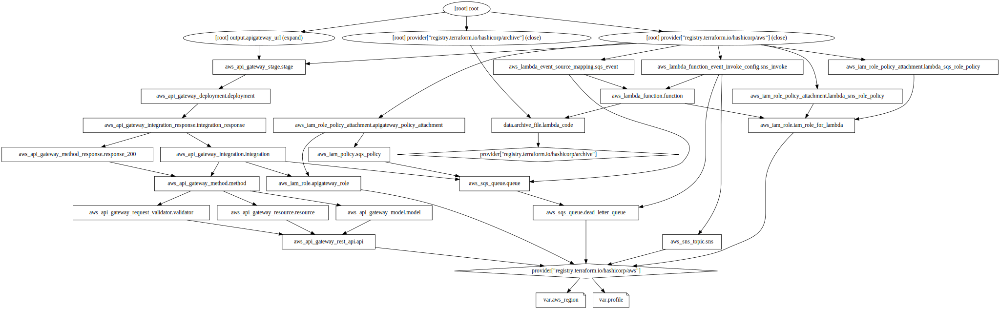

# Terraform apigateway sqs [IN PROGRESS] 60/100%

In this repository will lie a sample terraform proyect for an apigateway directly integrated with sqs

## Current state
missing route 53
missing  cloudfront distro and WAF
missing shield protection

missing working sns calling directly from apigateway

## Arquitecture

## Terraform state graph

